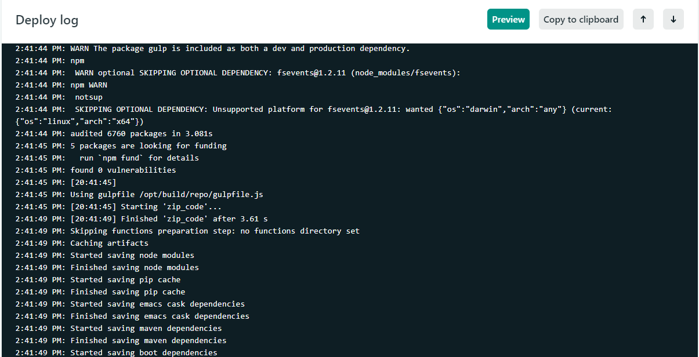
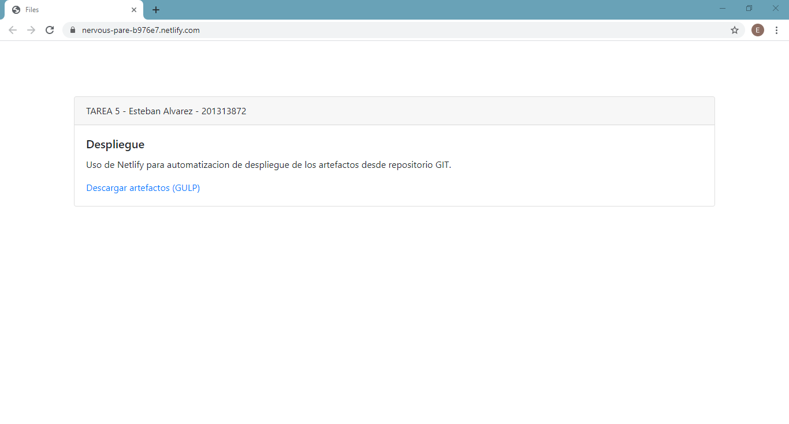

## Tarea 5: DevOps (2/2)
##### Esteban David Alvarez Bor - 201313872

La siguiente tarea consiste en la automatizacion para el despligue de los artefactos del repositorio mediante el sitio Netlify y GULP para lograr el objetivo. Se utilizo como base la tarea 4 y el desarrollo se realizo en la rama **deb-TAREA5**.


## Configuracion de Netlify

Para las configuraciones de construccion se realizaron modificaron los siguientes parametros en Netlify de la siguiente forma:
* **Repository:** 
```
 https://github.com/estebanalvarez/TAREA4 (deb-TAREA5)
```
* **Build command:** 
``` 
npm run deb  
``` 
* **Publish directory:** 
```
/public
```

## Build command
Para realizar la construccion de la aplicacion se utilizo el archivo __package.json__ utilizando el script llamado **deb** para completar la construccion tanto de la aplicacion como de los artefactos.

```json
    ...
    "scripts": {
        "deb": "npm install && gulp zip_code "
    },
    ...
```
* **npm install:** instalara todos los modulos de node necesarios para el correcto funcionamiento de la aplicacion.
* **gulp zip_code** se encargara de ejecutar la gulp task encargada de generar los artefactos. 

## GULP

Se incorporo la herramienta para la construccion de artefactos **GULP**. Esta herramienta nos permite ejecutar tareas "task" personalizadas las cuales construiran el codigo proporcionado. Se realizo una tarea para comprimir todo el codigo de la tarea 4 en un archivo con extension **.zip** para luego ser almacenado en la carpeta __./publico__

```js
var gulp = require('gulp');
var zip = require('gulp-zip');

/**
 * GULP task comprime el codigo a .zip
 * nombre del archivo code.zip
 * destino del archivo /code
 */
gulp.task('zip_code', function() {
    return gulp.src('./**')
        .pipe(zip('code.zip'))
        .pipe(gulp.dest('./public'));
});
```

Esta tarea llamada **zip_code** requiere del modulo **gulp** y **gulp-zip** para poder generar un archivo comprimirdo con el codigo de la tarea, especificandole la fuente o carpeta del codigo que se desea comprimir __./\*\*__ , el nombre del archivo resultante, **code.zip**, y el destino del archivo. **./public**.

Para ejecutar la tarea de gulp ejecutaremos el comando en la terminal, dentro de la ruta donde se encuentra nuestro codigo y el archivo principal **__gulpfile.js__**
```js
gulp zip_code
```
Podremos visualizar en la terminal del delploy de Netlify el procesamiento de la tarea:



## Despliegue del sitio 

Para acceder a los artefactos acceder al siguiente enlace: [TAREA 5](https://nervous-pare-b976e7.netlify.com/) 

